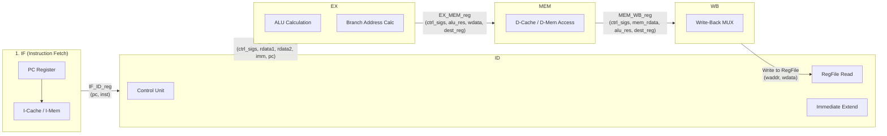
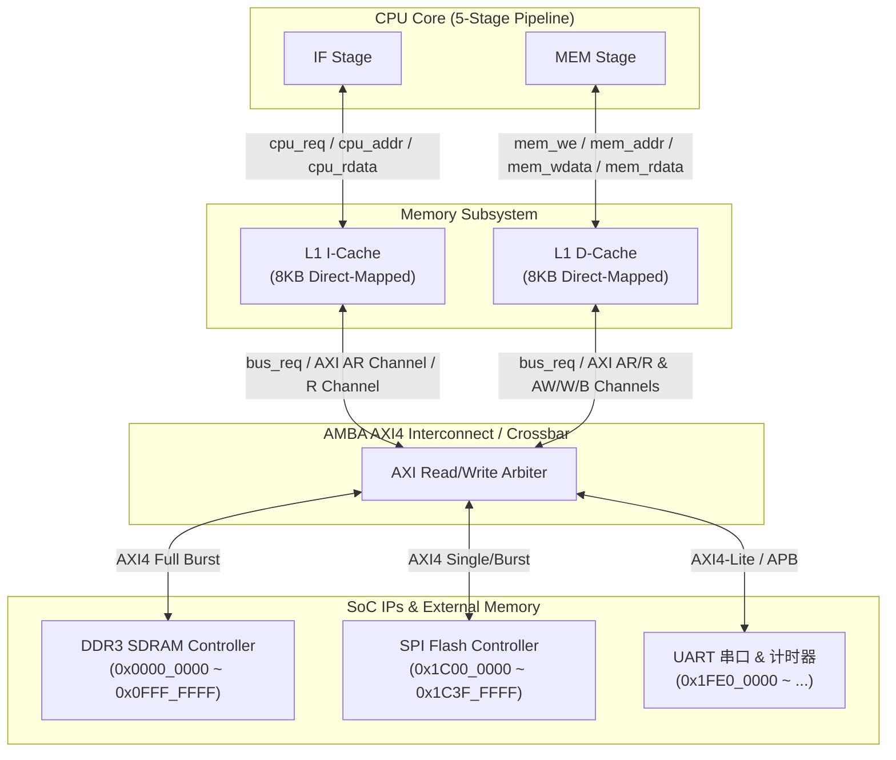

# 从零到龙芯杯工业级 SoC：手把手手写代码与重构指南

> **作者**：20年资深 CPU 架构师 & “魔鬼导师”
> **目标读者**：计算机体系结构零基础、Verilog 零基础、想要从零攻克龙芯杯（LoongArch32）的参赛团队
> **定位**：团队的“第一桶金”——彻底抛弃空洞理论，用工业级可综合（Synthesizable）的 Verilog 代码，教你们写下第一行代码，建立起完备的 SoC 底座。

---

## 目录
1. [从单周期到五级流水线的保姆级蜕变](#一从单周期到五级流水线的保姆级蜕变)
   - 1.1 工业级最小完备核心：LoongArch32 单周期 CPU Verilog 实现
   - 1.2 怎样把单周期“一刀切”成五级流水线？
   - 1.3 数据冒险与控制冒险的工业级解法（前递与暂停）
2. [龙芯杯 AXI 总线与 Cache 的“第一脚油门”](#二龙芯杯-axi-总线与-cache-的第一脚油门)
   - 2.1 工业级基础 Cache 状态机 Verilog 模板（I-Cache & D-Cache）
   - 2.2 AXI4/AXI4-Lite 总线标准握手状态机实现
   - 2.3 CPU-Cache-AXI 架构连线总览
3. [6周逆袭：版本迭代闭环路线图](#三6周逆袭版本迭代闭环路线图)
   - 3.1 第 1-2 周：单周期闭环与 Verilator/Vivado 仿真环境搭建
   - 3.2 第 3-4 周：五级流水线打磨与 89 条基准指令全覆盖
   - 3.3 第 5-6 周：Cache 接入、AXI SoC 挂载与 FPGA 上板冲分

---

## 一、从单周期到五级流水线的保姆级蜕变

你们连什么是时钟周期都在一知半解，听别人讲流水线就像在听天书。记住了：**所有复杂的五级流水线、超标量处理器，其最本质的计算骨架，就是一个“单周期 CPU”！**

单周期 CPU 的哲学是：**在同一个时钟周期（Clock Cycle）内，完成取指（Fetch）、译码（Decode）、执行（Execute）、访存（Memory）和写回（Write-Back）的全部工作。** 虽然它的主频慢得像蜗牛（因为关键路径要穿越所有这些组合逻辑），但它是你们建立硬件电路思维的唯一起点！

### 1.1 工业级最小完备核心：LoongArch32 单周期 CPU Verilog 实现

不要去抄网上那些乱七八糟、命名混乱、不可综合的垃圾代码。下面是我为你们定制的 **LoongArch32 精简版核心单周期 CPU 代码**（涵盖最重要的加法 `add.w`、立即数加法 `addi.w`、加载 `ld.w`、存储 `st.w`、分支条件跳转 `beq` 指令）。这套代码采用了工业标准命名规范与严格的复位逻辑。

#### 模块一：通用寄存器堆 (RegFile)
LoongArch32 包含 32 个 32 位通用寄存器 `$r0 ~ $r31`，其中 `$r0` 恒定为 `0`。

```verilog
`timescale 1ns / 1ps

module regfile (
    input  wire        clk,
    input  wire        rst_n,      // 低电平异步复位
    // 读端口 1
    input  wire [4:0]  raddr1,
    output wire [31:0] rdata1,
    // 读端口 2
    input  wire [4:0]  raddr2,
    output wire [31:0] rdata2,
    // 写端口
    input  wire        we,         // 写使能
    input  wire [4:0]  waddr,
    input  wire [31:0] wdata
);

    // 定义 32 个 32 位寄存器
    reg [31:0] rf [31:0];
    integer i;

    // 读操作：组合逻辑，异步读取。$r0 始终为 0
    assign rdata1 = (raddr1 == 5'd0) ? 32'd0 : rf[raddr1];
    assign rdata2 = (raddr2 == 5'd0) ? 32'd0 : rf[raddr2];

    // 写操作：时序逻辑，时钟上升沿同步写入
    always @(posedge clk or negedge rst_n) begin
        if (!rst_n) begin
            for (i = 0; i < 32; i = i + 1) begin
                rf[i] <= 32'd0;
            end
        end else if (we && (waddr != 5'd0)) begin
            rf[waddr] <= wdata;
        end
    end

endmodule
```

#### 模块二：算术逻辑单元 (ALU)
工业级 ALU 设计讲究单层组合逻辑，避免多层嵌套的 `if-else` 带来冗长延迟。

```verilog
`timescale 1ns / 1ps

module alu (
    input  wire [31:0] src1,
    input  wire [31:0] src2,
    input  wire [3:0]  alu_op,     // 4位操作码
    output reg  [31:0] result,
    output wire        zero        // 结果是否为0（用于条件跳转）
);

    // ALU 操作码定义
    localparam ALU_ADD  = 4'd0;
    localparam ALU_SUB  = 4'd1;
    localparam ALU_AND  = 4'd2;
    localparam ALU_OR   = 4'd3;
    localparam ALU_XOR  = 4'd4;
    localparam ALU_SLL  = 4'd5;
    localparam ALU_SRL  = 4'd6;
    localparam ALU_SRA  = 4'd7;
    localparam ALU_SLT  = 4'd8;  // 有符号比较
    localparam ALU_SLTU = 4'd9;  // 无符号比较

    assign zero = (result == 32'd0);

    always @(*) begin
        case (alu_op)
            ALU_ADD:  result = src1 + src2;
            ALU_SUB:  result = src1 - src2;
            ALU_AND:  result = src1 & src2;
            ALU_OR:   result = src1 | src2;
            ALU_XOR:  result = src1 ^ src2;
            ALU_SLL:  result = src1 << src2[4:0];
            ALU_SRL:  result = src1 >> src2[4:0];
            ALU_SRA:  result = $signed(src1) >>> src2[4:0];
            ALU_SLT:  result = ($signed(src1) < $signed(src2)) ? 32'd1 : 32'd0;
            ALU_SLTU: result = (src1 < src2) ? 32'd1 : 32'd0;
            default:  result = 32'd0; // 必须写 default，防锁存器！
        endcase
    end

endmodule
```

#### 模块三：控制单元 (Control Unit)
把 LoongArch32 指令译码成各执行模块的控制信号。这里以最经典的 5 条指令为例：

```verilog
`timescale 1ns / 1ps

module control_unit (
    input  wire [31:0] inst,
    output reg         reg_we,     // 寄存器写使能
    output reg         alu_src,    // 0: 寄存器 src2; 1: 立即数 imm
    output reg  [3:0]  alu_op,     // ALU操作
    output reg         mem_we,     // 数据存储器写使能
    output reg         mem_to_reg, // 0: ALU结果写回; 1: 访存读出数据写回
    output reg         branch      // 分支跳转标记
);

    // LoongArch32 操作码切片（基于龙芯规范）
    wire [5:0] op_31_26 = inst[31:26];
    wire [3:0] op_25_22 = inst[25:22];

    always @(*) begin
        // 默认控制信号全部无效，极佳的安全工程习惯！
        reg_we     = 1'b0;
        alu_src    = 1'b0;
        alu_op     = 4'd0;
        mem_we     = 1'b0;
        mem_to_reg = 1'b0;
        branch     = 1'b0;

        // 简易译码逻辑
        if (op_31_26 == 6'b000000) begin
            case (op_25_22)
                4'b0000: begin // add.w: 000000_0000_...
                    reg_we     = 1'b1;
                    alu_src    = 1'b0;
                    alu_op     = 4'd0; // ADD
                    mem_we     = 1'b0;
                    mem_to_reg = 1'b0;
                end
                default: ;
            endcase
        end
        else if (op_31_26 == 6'b000010) begin // addi.w (2I-12格式)
            reg_we     = 1'b1;
            alu_src    = 1'b1; // 选择立即数
            alu_op     = 4'd0; // ADD
            mem_we     = 1'b0;
            mem_to_reg = 1'b0;
        end
        else if (op_31_26 == 6'b001010) begin // ld.w
            reg_we     = 1'b1;
            alu_src    = 1'b1; // 计算地址：rs1 + imm
            alu_op     = 4'd0;
            mem_we     = 1'b0;
            mem_to_reg = 1'b1; // 从存储器写回
        end
        else if (op_31_26 == 6'b001011) begin // st.w
            reg_we     = 1'b0;
            alu_src    = 1'b1; // 计算地址
            alu_op     = 4'd0;
            mem_we     = 1'b1; // 开启存储器写
            mem_to_reg = 1'b0;
        end
        else if (op_31_26 == 6'b011000) begin // beq
            reg_we     = 1'b0;
            alu_src    = 1'b0; // 比较 rs1 和 rs2
            alu_op     = 4'd1; // SUB (判断 zero)
            mem_we     = 1'b0;
            branch     = 1'b1;
        end
    end

endmodule
```

#### 模块四：顶层组合：单周期 CPU (Single-Cycle CPU Top)

```verilog
`timescale 1ns / 1ps

module cpu_core_single_cycle (
    input  wire        clk,
    input  wire        rst_n,
    
    // 指令存储器接口 (I-Mem)
    output wire [31:0] imem_addr,
    input  wire [31:0] imem_data,
    
    // 数据存储器接口 (D-Mem)
    output wire        dmem_we,
    output wire [31:0] dmem_addr,
    output wire [31:0] dmem_wdata,
    input  wire [31:0] dmem_rdata
);

    // PC 寄存器
    reg [31:0] pc;
    wire [31:0] next_pc;
    wire [31:0] pc_plus_4;
    wire [31:0] branch_target;

    assign imem_addr = pc;
    assign pc_plus_4 = pc + 32'd4;

    // 译码切片
    wire [4:0] raddr1 = imem_data[9:5];   // rj
    wire [4:0] raddr2 = imem_data[4:0];   // rk / rd(for st.w)
    wire [4:0] waddr  = imem_data[4:0];   // rd(for add.w/addi.w/ld.w)
    
    // 立即数扩展 (LoongArch 12位有符号立即数，位于 [21:10])
    wire [31:0] imm_12 = {{20{imem_data[21]}}, imem_data[21:10]};
    // 分支偏移量 (16位，左移2位，位于 [25:10])
    wire [31:0] imm_br = {{14{imem_data[25]}}, imem_data[25:10], 2'b00};

    // 控制单元信号
    wire        reg_we;
    wire        alu_src;
    wire [3:0]  alu_op;
    wire        mem_we;
    wire        mem_to_reg;
    wire        branch;

    control_unit u_ctrl (
        .inst       (imem_data),
        .reg_we     (reg_we),
        .alu_src    (alu_src),
        .alu_op     (alu_op),
        .mem_we     (mem_we),
        .mem_to_reg (mem_to_reg),
        .branch     (branch)
    );

    // 寄存器堆
    wire [31:0] rdata1, rdata2;
    wire [31:0] wdata;

    regfile u_rf (
        .clk    (clk),
        .rst_n  (rst_n),
        .raddr1 (raddr1),
        .rdata1 (rdata1),
        .raddr2 (raddr2),
        .rdata2 (rdata2),
        .we     (reg_we),
        .waddr  (waddr),
        .wdata  (wdata)
    );

    // ALU 选路与例化
    wire [31:0] alu_operand2 = alu_src ? imm_12 : rdata2;
    wire [31:0] alu_result;
    wire        alu_zero;

    alu u_alu (
        .src1   (rdata1),
        .src2   (alu_operand2),
        .alu_op (alu_op),
        .result (alu_result),
        .zero   (alu_zero)
    );

    // 访存与写回逻辑
    assign dmem_we    = mem_we;
    assign dmem_addr  = alu_result;
    assign dmem_wdata = rdata2;
    assign wdata      = mem_to_reg ? dmem_rdata : alu_result;

    // 分支判断与下一 PC 计算
    wire branch_take = branch & alu_zero;
    assign branch_target = pc + imm_br;
    assign next_pc = branch_take ? branch_target : pc_plus_4;

    // PC 时序同步更新
    always @(posedge clk or negedge rst_n) begin
        if (!rst_n) begin
            pc <= 32'h1c000000; // LoongArch 典型复位启动地址
        end else begin
            pc <= next_pc;
        end
    end

endmodule
```

---

### 1.2 怎样把单周期“一刀切”成五级流水线？

单周期 CPU 为什么不能跑龙芯杯？因为如果把整个处理层叠在一个时钟周期内，组合逻辑链极长。在 Artix-7 FPGA 上，你们综合出来的单周期主频可能最高只有 **15MHz ~ 20MHz**。
要提速到 **50MHz、80MHz 甚至 100MHz 以上**，唯一的办法是在又长又慢的组合逻辑之间，**插入一组组触发器（寄存器）——这就是流水线寄存器（Pipeline Registers）**！

按照经典架构，我们将 CPU 狠狠一刀切成五段：



#### 工业级切刀法则：如何编写流水线寄存器？
不要把流水线寄存器写得散乱无章。在工业界，我们通常将一级流水线之间传递的所有数据绑定在一个 `struct` 或打包信号束中，使用简洁清晰的时序模块进行传递：

```verilog
// 工业级 IF/ID 流水线寄存器示例
module if_id_reg (
    input  wire        clk,
    input  wire        rst_n,
    input  wire        stall,      // 流水线暂停使能
    input  wire        flush,      // 流水线冲刷使能 (处理分支跳转)
    // 输入端 (来自 IF 级)
    input  wire [31:0] if_pc,
    input  wire [31:0] if_inst,
    // 输出端 (发往 ID 级)
    output reg  [31:0] id_pc,
    output reg  [31:0] id_inst
);

    always @(posedge clk or negedge rst_n) begin
        if (!rst_n) begin
            id_pc   <= 32'd0;
            id_inst <= 32'h03400000; // LoongArch 的 nop 指令 (addi.w $r0, $r0, 0)
        end else if (flush) begin
            id_pc   <= 32'd0;
            id_inst <= 32'h03400000; // 遇到跳转冲刷，塞入 nop 气泡
        end else if (!stall) begin
            id_pc   <= if_pc;
            id_inst <= if_inst;      // 没有暂停时，正常往下流
        end
        // 如果 stall == 1，保持原值不动（锁死当前状态）
    end

endmodule
```

---

### 1.3 数据冒险与控制冒险的工业级解法（前递与暂停）

一旦拆成流水线，最大的噩梦就会降临：**冒险（Hazards）**！如果你不处理，流水线写出的 CPU 必定计算错误。

#### 1. 数据冒险：Bypass / Forwarding（前递）
**场景**：第一条指令是 `add.w $r1, $r2, $r3`（此时结果还在 EX 级或 MEM 级，还没有写回 RegFile），紧接着第二条指令是 `sub.w $r4, $r1, $r5`，需要读 `$r1`。如果直接去 RegFile 读，读到的是老数据！
**解法**：不拿老数据，直接将 EX 级计算出的最新结果、或 MEM 级的最新访存数据，通过多路选择器**直接拉到（Forward）**下一条指令的 ALU 输入端！

```verilog
// 工业级前递单元 (Forwarding Unit) - 属于纯组合逻辑
module forwarding_unit (
    // 来自 ID 级的源寄存器需求
    input  wire [4:0] id_ex_rs1,
    input  wire [4:0] id_ex_rs2,
    
    // 来自 EX/MEM 流水线寄存器的写回信息
    input  wire       ex_mem_reg_we,
    input  wire [4:0] ex_mem_rd,
    
    // 来自 MEM/WB 流水线寄存器的写回信息
    input  wire       mem_wb_reg_we,
    input  wire [4:0] mem_wb_rd,
    
    // 输出给 EX 级 ALU 多路选择器的控制信号
    output reg  [1:0] forward_a,  // 00:来自RegFile; 10:来自EX/MEM; 01:来自MEM/WB
    output reg  [1:0] forward_b
);

    always @(*) begin
        // 默认选择 ID/EX 寄存器里的普通操作数
        forward_a = 2'b00;
        forward_b = 2'b00;

        // 1. EX/MEM 冒险前递 (优先级最高，因为离当前指令最近)
        if (ex_mem_reg_we && (ex_mem_rd != 5'd0) && (ex_mem_rd == id_ex_rs1)) begin
            forward_a = 2'b10;
        end
        // 2. MEM/WB 冒险前递 (优先级次之)
        else if (mem_wb_reg_we && (mem_wb_rd != 5'd0) && (mem_wb_rd == id_ex_rs1)) begin
            forward_a = 2'b01;
        end

        // 对操作数 B 同理判断
        if (ex_mem_reg_we && (ex_mem_rd != 5'd0) && (ex_mem_rd == id_ex_rs2)) begin
            forward_b = 2'b10;
        end
        else if (mem_wb_reg_we && (mem_wb_rd != 5'd0) && (mem_wb_rd == id_ex_rs2)) begin
            forward_b = 2'b01;
        end
    end

endmodule
```

#### 2. Load-Use 冒险与控制冒险暂停（Stall & Flush）
**场景**：前一条是 `ld.w $r1, $r2, 0`，下一条立刻要用 `$r1`。这时候数据还在内存里，在 EX 级根本无法前递！
**解法**：必须让流水线**暂停（Stall）一个周期**，等待访存数据读出，然后再前递！
**控制冒险（分支跳转）**：如果在 EX 级才计算出 `beq` 跳转成立，那么 IF 和 ID 级已经被错误读入了后面的指令。此时必须将 IF/ID 和 ID/EX 流水线寄存器**冲刷（Flush）清空为 Nop 指令**！

```verilog
// 工业级冒险检测与流水线控制器 (Hazard Detection Unit)
module hazard_detection_unit (
    // Load-Use 检测
    input  wire       id_ex_mem_read,  // 上一条指令是否是 Load
    input  wire [4:0] id_ex_rd,        // 上一条指令的目标寄存器
    input  wire [4:0] if_id_rs1,       // 当前译码指令的源寄存器 1
    input  wire [4:0] if_id_rs2,       // 当前译码指令的源寄存器 2
    
    // 控制冒险（分支跳转发生）
    input  wire       branch_taken,    // EX 级分支跳转是否成立
    
    // 输出流水线控制信号
    output reg        pc_stall,
    output reg        if_id_stall,
    output reg        if_id_flush,
    output reg        id_ex_flush
);

    always @(*) begin
        // 默认状态：流水线正常跑
        pc_stall    = 1'b0;
        if_id_stall = 1'b0;
        if_id_flush = 1'b0;
        id_ex_flush = 1'b0;

        // 1. 处理分支跳转控制冒险 (优先级最高)
        if (branch_taken) begin
            if_id_flush = 1'b1; // 冲刷掉错取的指令
            id_ex_flush = 1'b1;
        end
        // 2. 处理 Load-Use 数据冒险
        else if (id_ex_mem_read && ((id_ex_rd == if_id_rs1) || (id_ex_rd == if_id_rs2)) && (id_ex_rd != 5'd0)) begin
            pc_stall    = 1'b1; // 冻结 PC，不再取新指令
            if_id_stall = 1'b1; // 冻结 IF/ID，让当前指令再待一个周期
            id_ex_flush = 1'b1; // 在 ID/EX 级插入一个 Nop 气泡 (Bubble)
        end
    end

endmodule
```

---

## 二、龙芯杯 AXI 总线与 Cache 的“第一脚油门”

想要跑龙芯杯大赛提供的测试程序，光有核没用。芯片要想去读取板载的 DDR3 SDRAM、Flash、UART 串口，必须走 **AMBA AXI4 总线协议**。而如果每次取指令和存数据都慢吞吞地走 AXI 去敲内存，性能分数会惨不忍睹。所以必须有 **Cache（高速缓冲存储器）**！

### 2.1 工业级基础 Cache 状态机 Verilog 模板（I-Cache & D-Cache）

对于刚入门的你们，先不要去搞多路组相联。我给你们写一个**直接映射（Direct-Mapped）、阻塞式（Blocking）、类 Write-Through/Refill** 的基础 I-Cache 核心状态机模板。

```verilog
`timescale 1ns / 1ps

module icache_direct_mapped #(
    parameter DATA_WIDTH = 32,
    parameter ADDR_WIDTH = 32,
    parameter CACHE_SIZE = 8192,        // 8KB (龙芯杯底线要求)
    parameter LINE_SIZE  = 32           // 32 Bytes per line (8 个字)
)(
    input  wire        clk,
    input  wire        rst_n,
    
    // CPU 侧接口
    input  wire                  cpu_req,    // 取指请求
    input  wire [ADDR_WIDTH-1:0] cpu_addr,   // 取指地址
    output reg  [DATA_WIDTH-1:0] cpu_rdata,  // 返回指令
    output reg                   cpu_hit,    // 命中信号 (1为有效)
    
    // AXI 总线转接侧接口 (发生缺失时请求总线补行)
    output reg                   bus_req,
    output reg  [ADDR_WIDTH-1:0] bus_addr,
    input  wire [DATA_WIDTH-1:0] bus_rdata,
    input  wire                  bus_ready   // 总线数据读回有效
);

    // 状态机编码
    localparam IDLE   = 2'b00;
    localparam LOOKUP = 2'b01;
    localparam REFILL = 2'b10;
    
    reg [1:0] state, next_state;

    // Cache 存储体定义 (针对 8KB, 32B/line -> 256 行)
    // 地址划分: [31:13] Tag (19位), [12:5] Index (8位), [4:0] Offset (5位)
    reg [18:0] tag_ram   [0:255];
    reg        valid_ram [0:255];
    reg [31:0] data_ram  [0:255][0:7]; // 每一行 8 个 32-bit 字

    wire [18:0] req_tag    = cpu_addr[31:13];
    wire [7:0]  req_idx    = cpu_addr[12:5];
    wire [2:0]  req_offset = cpu_addr[4:2]; // 字偏移

    wire hit = valid_ram[req_idx] && (tag_ram[req_idx] == req_tag);

    // 状态迁移逻辑
    always @(posedge clk or negedge rst_n) begin
        if (!rst_n) state <= IDLE;
        else        state <= next_state;
    end

    // 状态转换条件
    always @(*) begin
        next_state = state;
        case (state)
            IDLE: begin
                if (cpu_req) next_state = LOOKUP;
            end
            LOOKUP: begin
                if (hit) next_state = IDLE;
                else     next_state = REFILL; // 未命中，去总线搬数据
            end
            REFILL: begin
                if (bus_ready) next_state = LOOKUP; // 补行完成，重新查询
            end
            default: next_state = IDLE;
        endcase
    end

    // 状态输出控制
    always @(*) begin
        cpu_hit   = 1'b0;
        bus_req   = 1'b0;
        bus_addr  = {cpu_addr[31:5], 5'b0}; // 突发读对齐到 Cache Line 首地址
        cpu_rdata = data_ram[req_idx][req_offset];

        if (state == LOOKUP && hit) begin
            cpu_hit = 1'b1;
        end else if (state == REFILL) begin
            bus_req = 1'b1;
        end
    end

    // Cache 更新逻辑 (在 REFILL 完成时写入 RAM)
    always @(posedge clk or negedge rst_n) begin
        if (!rst_n) begin
            integer i;
            for (i = 0; i < 256; i = i + 1) valid_ram[i] <= 1'b0;
        end else if (state == REFILL && bus_ready) begin
            valid_ram[req_idx] <= 1'b1;
            tag_ram[req_idx]   <= req_tag;
            // 简化演示：实际应按照 burst 序列依次填满 data_ram[req_idx][0~7]
            data_ram[req_idx][req_offset] <= bus_rdata; 
        end
    end

endmodule
```

---

### 2.2 AXI4/AXI4-Lite 总线标准握手状态机实现

AXI 总线的灵魂是 ** VALID 与 READY 的双向握手**！
**铁律中的铁律**：作为主设备（Master），**发出 `VALID` 信号绝不能依赖于检测到从设备（Slave）的 `READY` 信号有效！** 一旦设定 `VALID <= 1`，必须保持高电平，直到检测到 `READY == 1` 发生同步握手，才能撤销 `VALID`！

下面是 industrial-grade 的 AXI4 Master 单字读取握手状态机模板：

```verilog
`timescale 1ns / 1ps

module axi_master_simple_if (
    input  wire        clk,
    input  wire        rst_n,
    
    // 来自内部 Cache/CPU 的请求
    input  wire        req_en,
    input  wire [31:0] req_addr,
    output reg  [31:0] resp_data,
    output reg         resp_done,
    
    // AXI4-Lite 读地址通道 (AR Channel)
    output reg  [31:0] araddr,
    output reg         arvalid,
    input  wire        arready,
    
    // AXI4-Lite 读数据通道 (R Channel)
    input  wire [31:0] rdata,
    input  wire [1:0]  rresp,
    input  wire        rvalid,
    output reg         rready
);

    localparam S_IDLE    = 2'd0;
    localparam S_SEND_AR = 2'd1;
    localparam S_WAIT_R  = 2'd2;
    localparam S_DONE    = 2'd3;

    reg [1:0] state, next_state;

    always @(posedge clk or negedge rst_n) begin
        if (!rst_n) state <= S_IDLE;
        else        state <= next_state;
    end

    always @(*) begin
        next_state = state;
        case (state)
            S_IDLE:    if (req_en)  next_state = S_SEND_AR;
            S_SEND_AR: if (arready && arvalid) next_state = S_WAIT_R;
            S_WAIT_R:  if (rvalid && rready)   next_state = S_DONE;
            S_DONE:                 next_state = S_IDLE;
            default:                next_state = S_IDLE;
        endcase
    end

    always @(posedge clk or negedge rst_n) begin
        if (!rst_n) begin
            arvalid   <= 1'b0;
            araddr    <= 32'd0;
            rready    <= 1'b0;
            resp_done <= 1'b0;
            resp_data <= 32'd0;
        end else begin
            // 必须在跳出 S_DONE 时复位单周期脉冲
            resp_done <= 1'b0; 

            case (state)
                S_IDLE: begin
                    if (req_en) begin
                        arvalid <= 1'b1;      // 无条件拉高 valid！不看 ready！
                        araddr  <= req_addr;
                    end
                end
                S_SEND_AR: begin
                    if (arready && arvalid) begin
                        arvalid <= 1'b0;      // 握手成功后才允许撤回 valid
                        rready  <= 1'b1;      // 准备接收数据
                    end
                end
                S_WAIT_R: begin
                    if (rvalid && rready) begin
                        rready    <= 1'b0;
                        resp_data <= rdata;   // 捕获总线数据
                        resp_done <= 1'b1;    // 向上层报告数据完成
                    end
                end
                default: ;
            endcase
        end
    end

endmodule
```

---

### 2.3 CPU-Cache-AXI 架构连线总览

你们的系统顶层架构（SoC Top）必须严格分层，千万不要把所有的线混杂在一个文件里。推荐的工业级互联规范如下：



---

## 三、6周逆袭：版本迭代闭环路线图

千万不要想着第一天写出总线，第二天写出 Linux。按照这套**工业级敏捷开发流水线**，一步一步扎扎实实地推进。每天必须跑通规定的回归测试（Regression Test）！

### 3.1 第 1-2 周：单周期闭环与 Verilator/Vivado 仿真环境搭建
* **核心任务**：
  1. 将第一章提供的单周期 CPU 框架搭建起来。
  2. 实现 LoongArch32 最核心的 15 条基础整数指令（`add.w`, `sub.w`, `slt`, `and`, `or`, `xor`, `addi.w`, `lu12i.w`, `ld.w`, `st.w`, `beq`, `bne`, `jirl`, `b`, `bl`）。
  3. **强烈建议**：抛弃极慢的 Vivado GUI 仿真，使用开源快速的 **Verilator + C++ / Python (Cocotb)** 搭建自动验证平台，用几秒钟跑完几万个周期！
* **必达验收指标**：
  * 自己手写一段汇编，测试 1+2+3+...+100，结果能够正确存入内存或控制寄存器，仿真波形无任何 `X`（未知态）和 `Z`（高阻态）！

### 3.2 第 3-4 周：五级流水线打磨与 89 条基准指令全覆盖
* **核心任务**：
  1. 将单周期重构为经典五级流水线（IF, ID, EX, MEM, WB）。
  2. 严格实现前递单元（Forwarding Unit）与暂停控制器（Hazard Unit），重点攻克 `Load-Use` 冲突和条件跳转预测（简单静态预测机制，错猜冲刷 2 个时钟周期气泡）。
  3. 实现初赛大纲要求的全部 **89 条 LoongArch32 基准指令**（包括移位指令、乘除法指令，可以使用 Vivado 提供的原生乘除法器 IP 例化）。
* **必达验收指标**：
  * 在 FPGA 片内 BRAM 上载入组委会发的第一阶段测试集（89 个指令功能测试小程序），通过**串口打印或者仿真输出，达到 89 项测试全通（100分满分）**！
  * **绝不能有任何一个未知态 `X` 扩散导致流水线死锁！**

### 3.3 第 5-6 周：Cache 接入、AXI SoC 挂载与 FPGA 上板冲分
* **核心任务**：
  1. 挂载 8KB I-Cache 和 8KB D-Cache，实现最基础的 Direct-Mapped + Write-Through + Write-Allocate（或 Write-Around）架构。
  2. 把 Cache 的后端通过 AXI-Master 接口与大赛提供的 SoC Subsystem（DDR3、Flash、计数器、串口）连接起来。
  3. 将时序约束文件（XDC）加入 Vivado 2023.2 工程，开启综合与布局布线（Implementation），在 **Artix-7 FPGA** 上真正烧写 bitstream。
  4. 开启内核系统计数器，运行大赛性能跑分测试程序，定位瓶颈并尝试提升时钟主频（目标：**60MHz -> 80MHz -> 100MHz**）！
* **必达验收指标**：
  * 在真正的 Artix-7 开发板上，看到 7 段数码管亮起成功标志，通过 RS-232 串口向终端跑出完美的性能评测分数，**为杀进决赛稳拿第一张门票！**

---
*(请结合下一篇《魔鬼特训：小白速成 CPU 架构师的硬核补课笔记.md》配合进行每日团队内训！)*
